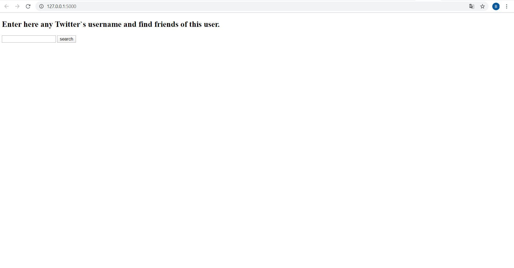
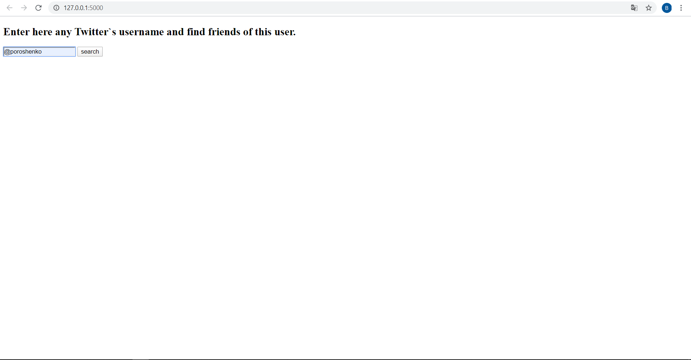
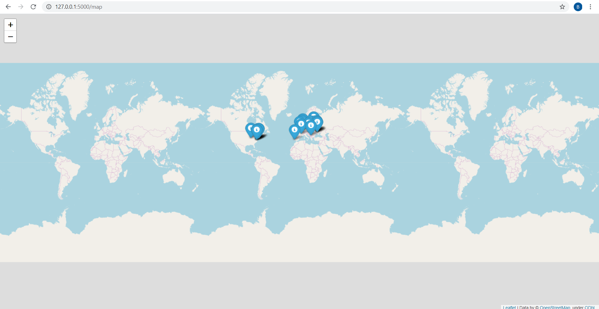

# task3_lab3
With the help of these modules web-application can be generated. There you can input username of any Twitter user and get a map, where
locations of all user`s friends are marked.

# Usage
After you download a repoository and install all libraries, that are needed (folium, flask, geocoder). Make next steps.
```python
set FLASK_APP = app.py
flask run
```

# Example

```python
flask run
 * Environment: production
   WARNING: This is a development server. Do not use it in a production deployment.
   Use a production WSGI server instead.
 * Debug mode: off
 * Running on http://127.0.0.1:5000/ (Press CTRL+C to quit)
```

What you see, when you go to http://127.0.0.1:5000



Then enter username



Here is your map!


